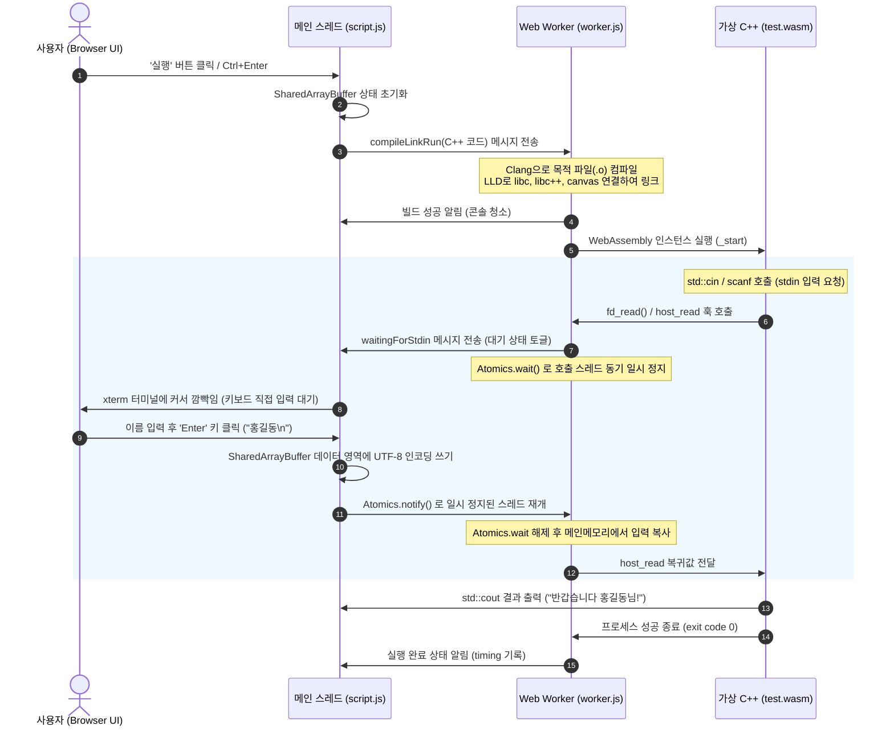

# Dadeum IDE - 브라우저 기반 서버리스 C++ 컴파일러 및 IDE
**다듬(Dadeum) IDE**는 웹 서버나 외부 컴파일 서버 없이 **100% 웹 브라우저 클라이언트 사이드**에서 C++ 코드를 컴파일, 링크 및 가상 실행할 수 있는 고성능 서버리스 웹 IDE 개발 도구입니다.

LLVM Clang 8.0.1 및 LLD 링커를 WebAssembly로 컴파일하여 백그라운드 Web Worker 환경에서 독립 실행하며, 메모리 상의 가상 파일 시스템(MemFS) 및 가상 POSIX 헤더/표준 라이브러리(libc, libc++)를 브라우저 내부에서 조합하여 온전한 C++ 빌드 환경을 구축합니다.


## ✨ 주요 기능
- **클라이언트 사이드 가상 빌드 툴체인**
   - 브라우저 메모리에 Clang 컴파일러와 LLD 링커를 다운로드하여 구동하므로 소스코드가 외부 서버로 전송되지 않습니다.
- **실시간 대화형 표준 입력(std::cin / scanf) 지원**
   - `SharedArrayBuffer`와 `Atomics` 동기화 기술을 사용하여, WASI 입출력 훅(`host_read`) 실행 시 백그라운드 C++ 실행 스레드를 일시정지(`wait`)시킵니다.
   - 사용자가 웹 터미널(xterm.js)에 값을 입력하고 엔터를 누르면 메인 스레드가 워커 스레드를 다시 깨워(`notify`) 실시간 입력을 처리합니다.
- **직관적인 간결한 빌드 결과물 표출**
   - 컴파일 성공 시 복잡한 빌드 컴파일/링크 상세 로그를 가리고 오직 깨끗한 프로그램 실행 결과(stdout/stderr)만 출력합니다.
   - 컴파일 에러 발생 시에만 터미널에 상세 오류 코드를 플러시하여 에러 디버깅을 돕습니다.
- **C++ 그래픽스 캔버스 프리뷰 (Graphics Preview)**
   - `#include <canvas_main.h>`를 통해 브라우저 오프스크린 캔버스와 브릿지된 그래픽 그리기 함수(`setup()`, `loop()`)를 제공하여 60FPS 속도의 물리학 엔진 시뮬레이션 및 그래픽 예제를 구동할 수 있습니다.
- **테마**
   - 시스템 설정 연동 다크/라이트 테마가 적용되어 있습니다.


## 📂 시스템 구조 및 동작 원리



## 🚀 로컬 개발 및 실행 방법
`SharedArrayBuffer`를 사용하여 메인 스레드와 컴파일 스레드 간 동기화를 처리하기 때문에, 브라우저 보안 규정상 **교차 출처 격리(Cross-Origin Isolation)** 헤더를 의무적으로 지원하는 개발 서버가 필요합니다.

### 1. serve 모듈 설치 및 설정
프로젝트 루트 폴더의 serve.json 파일에는 아래와 같이 격리 정책을 선언하는 COOP/COEP HTTP 헤더 설정이 내장되어 있습니다.

```json
{
  "headers": [
    {
      "source": "**/*",
      "headers": [
        {
          "key": "Cross-Origin-Opener-Policy",
          "value": "same-origin"
        },
        {
          "key": "Cross-Origin-Embedder-Policy",
          "value": "require-corp"
        }
      ]
    }
  ]
}
```

### 2. 로컬 서버 시작
npm의 `serve` CLI 명령어를 활용하여 해당 폴더 내의 로컬 정적 웹 서버를 구동합니다.
```bash
npx serve -l 8000 ./
```

웹 브라우저를 열고 `http://localhost:8000`에 접속합니다.


## ✍🏻 C++ 소스코드 작성 예제

### 실시간 터미널 대화형 표준 입출력 예제
```cpp
#include <iostream>
#include <string>

using namespace std;

int main() {
    string name;
    int age;

    cout << "이름을 입력하세요: ";
    getline(cin, name); // 공백을 포함한 문자열 한 줄 입력

    cout << "나이를 입력하세요: ";
    cin >> age;

    cout << "\n--- 입력 결과 ---" << endl;
    cout << "안녕하세요, " << name << "님!" << endl;
    cout << "내년에는 " << (age + 1) << "살이 되시겠군요." << endl;

    return 0;
}
```

### 가상 캔버스 그래픽 그리기 예제
```cpp
#include <canvas_main.h>
#include <vector>
#include <cmath>

// 800x600 캔버스 선언
Canvas canvas{800, 600};
double offset = 0.0;

void setup() {
    canvas.setLineCap(LINE_CAP_ROUND);
}

// 매 프레임(60FPS) 호출되는 실시간 루프 함수
void loop(double timeSec, double elapsedSec) {
    canvas.clearRect(0, 0, 800, 600);
    
    // 배경 채우기
    canvas.setFillStyle("#080c16");
    canvas.fillRect(0, 0, 800, 600);
    
    // 움직이는 원 그리기
    offset += elapsedSec * 2.0;
    double x = 400 + 150 * cos(offset);
    double y = 300 + 150 * sin(offset);
    
    canvas.beginPath();
    canvas.arc(x, y, 40, 0, 2 * M_PI);
    canvas.setFillStyle("#06b6d4");
    canvas.fill(FILL_RULE_NONZERO);
}
```
